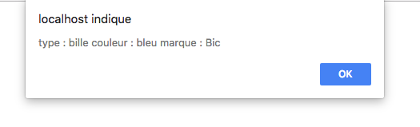

# Les objets

Un objet est avant tout une classe. Une classe est un 'template/carte d'identité' qui définit ce qu'il y a l'intérieur de l'objet.
Jusqu'ici, vous avez appris à créer des programmes plutôt basés sur des fonctions : c'est ce que l'on appelle parfois la programmation procédurale.

cette classe contient :

- Des variables = appelées attributs ou propriétés qui caractérise l'objet
- Des fonctions = appelées méthodes, qui permettront (entre autre) d'agir sur cet objet.

Cet objet possède des propriétés. Imaginons que dans la vraie vie on ai un objet, un stylo par exemple. Il peut avoir des propriétés différentes : couleur, marque, prix etc..

## Introduction

### Si on a 1 seul objet on peut utiliser la notation litérale :

```js
let stylo = {
    type: "bille",
    couleur: "bleu",
    marque: "Bic",

    id : function(){ // Une méthode
        return 'type : ' + this.type + ' couleur : ' + this.couleur + ' marque : ' + this.marque;
    }
};
console.log("Mon stylo à " + stylo.type + " " + stylo.marque + " écrit en " + stylo.couleur);
alert(stylo.id());
```



- `id` : une méthode pour retourner les infos de l'objet.

- Modifier l'objet : `stylo.couleur = "vert";`
- Ajouter un objet : `stylo.prix = 2.17;`

### Créer un objet

```js
let monStylo = new Object();
    monStylo.type = "bille";
    monStylo.couleur = "bleu";
    monStylo.marque = "Bic";
  
```

On peut aussi définir ou accéder à des propriétés JavaScript en utilisant une notation avec les crochets.

```js
monStyle["type"] = "bille";
```

Il a donc 3 propriétés. 

## Créer un objet à partir d'un constructeur : utiliser une fonction

n constructeur est une fonction particulière dont le rôle est d'initialiser un nouvel objet. Son nom commence souvent par une lettre majuscule, mais ce n'est pas une obligation.

La création de l'objet à partir du constructeur est appelée l'instanciation. Elle s'effectue à l'aide du mot-clé `new` .

```js
// Constructeur MonObjet
function stylo (type, couleur, marque) { // les propriétés de l'objet
    // Initialisation de l'objet
    this.type = type; // On affecte des valeurs aux propriétés . (pour lier avec new stylo())
    this.couleur = couleur;
    this.marque = marque;
}
// Instanciation d'un objet à partir du constructeur
let bicDeMarie = new stylo("bille", "bleu", "bic");

```

On utilise `this` pour affecter des valeurs aux propriétés d'un objet en fonction des valeurs passées en arguments de la fonction.

Imaginons que je veux que le propriétaire soit aussi un objet

```js
function Stylo (type, couleur, marque, propriétaire) { // les propriétés de l'objet
    // Initialisation de l'objet
    this.type = type; // On affecte des valeurs aux propriétés . (pour lier avec new stylo())
    this.couleur = couleur;
    this.marque = marque;
    this.propriétaire = propriétaire;
}
function Proprietaire (nom, age, sexe){
    this.nom = nom;
    this.age = age;
    this.sexe = sexe;
}
let marie = new Proprietaire("Marie", 35, "F");
let bic1 = new Stylo("bille", "bleu", "bic", marie);


console.log(bic1.propriétaire.nom);

```

## Parcourir un objet

```js
for(let element in stylo){
    console.log(element); // Affiche chaque clé
    console.log(stylo[element]); // Affiche chaque valeur
}

```