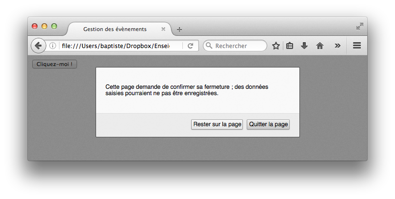

# Les événements


## Différents types d'événements

| Catégorie             | Exemples                                                                                                           |
|-----------------------|--------------------------------------------------------------------------------------------------------------------|
| Evénements clavier    | Appui ou relâchement d'une touche du clavier                                                                       |
| Evénements souris     | Click avec les différents boutons, appui ou relâchement d'un bouton de la souris, survol d'une zone avec la souris |
| Evénements fenètre    | Chargement ou fermeture de la page, redimensionnement, défilement(scrolling)                                       |
| Evénements formulaire | Changement de cible saisie (focus), envoi d'un formulaire                                                          |

<span style="color:red;">Quel que soit l'évènement, son déclanchement crée un objet event</span> qui peut être utilisé par la fonction qui gère l'événement. Cet objet dispose de propriétés qui fournissent des informations sur l'événement, et de méthodes qui permettent d'agir sur celui-ci.

`type` : renvoie le type de l'évènement.
`target`: fait référence à l'objet qui à envoyé l'évènement. Le bouton par exeple `e.target.textContent`-> Cliquez-moi (le texte du bouton)

## Par exemple lorsque je clique sur un bouton :

### Par rapport à son id

l'html :

```html
<button id="bouton">Cliquez-moi !</button>
```

le javascript :

```js
function clic() {
    console.log("Clic !");
}

var boutonElt = document.getElementById("bouton");
// Ajout d'un gestionnaire pour l'événement click
boutonElt.addEventListener("click", clic);
```

Ou avec une fonction anonyme

```js
var boutonElt = document.getElementById("bouton");
// Ajout d'un gestionnaire pour l'événement click
boutonElt.addEventListener("click", function () {
    console.log("clic");
});
```

### Appel de la fonction sur le bouton


## Quand jappuie sur une touche du clavier

```js
// Gestion de l'appui sur une touche du clavier produisant un caractère
document.addEventListener("keypress", function (e) {
    console.log("Vous avez appuyé sur la touche " + String.fromCharCode(e.charCode));
    // -> Vous avez appuyé sur la touche p
});


// Affiche des informations sur un événement clavier
function infosClavier(e) {
    console.log("Evènement clavier : " + e.type + ", touche : " + e.keyCode);
    // -> Evènement clavier : keydown, touche : 80
}

// Gestion de l'appui et du relâchement d'une touche du clavier
document.addEventListener("keydown", infosClavier);
document.addEventListener("keyup", infosClavier);
```

`keypress` : quand on appuie sur une touche
`e.charCode`: la valeur numérique associée au caractère
`String.fromCharCode()`: permet de traduire cette valeur en la lettre de la touche

## Savoir ou l'utilisateur à cliqué sur la page (souris ou doigts)

clientX/clientY : renvoient les coordonnées horiontales et verticales de l'endoit ou les clic s'est produit. Par rapport à la zone de la page qui est affichée (et non pas depuis le haut réel de la page)

### code qui nous dit où on a cliqué dans la page, vec quel bouton de la souris

```js
// Renvoie le nom du bouton souris à partir de son code
function getBoutonSouris(code) {
    var bouton = "inconnu";
    switch (code) {
    case 0: // 0 est le code du bouton gauche
        bouton = "gauche";
        break;
    case 1: // 1 est le code du bouton du milieu
        bouton = "milieu";
        break;
    case 2: // 2 est le code du bouton droit
        bouton = "droit";
        break;
    }
    return bouton;
}

// Affiche des informations sur un événement souris
function infosSouris(e) {
    console.log("Evènement souris : " + e.type + ", bouton " +
        getBoutonSouris(e.button) + ", X : " + e.clientX + ", Y : " + e.clientY);
        // -> Evènement souris : click, bouton gauche, x : 101, Y : 221
}

// Gestion du clic souris
document.addEventListener("click", infosSouris);
```

## Fermeture de la page web

Demander une confirmation pour fermer la page

```js
// Gestion de la fermeture de la page web
window.addEventListener("beforeunload", function (e) {
    var message = "On est bien ici !";
    e.returnValue = message; // Provoque une demande de confirmation (standard)
    return message; // Provoque une demande de confirmation (certains navigateurs)
});
```



## La propagation des évènements

Si je met un clic sur un bouton et que je veux qu'il se propage à son parent. Je met l'évènement sur le bouton

```html
<p id="para">Un paragraphe avec un
    <button id="propa">bouton</button> à l'intérieur
</p>

<script>
// Gestion du clic sur le paragraphe
document.getElementById("para").addEventListener("click", function () {
    console.log("Gestionnaire paragraphe");
});
// Gestion du clic sur le bouton
document.getElementById("propa").addEventListener("click", function (e) {
    console.log("Gestionnaire bouton");
});
</script>
```

Arrêter la propoagation : `e.stopPropagation();` sur (e)