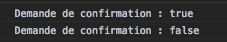
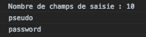

# Formulaires et vérifications des inputs avant envoi

## html de base :

```html
        <form>
                <h1>Formulaire d'inscription</h1>
                <p>
                    <label for="pseudo">Pseudo</label> :
                    <input type="text" name="pseudo" id="pseudo" required>
                    <span id="aidePseudo"></span>
                </p>
                <p>
                    <label for="mdp">Mot de passe</label> :
                    <input type="password" name="mdp" id="mdp" required>
                    <span id="aideMdp"></span>
                </p>
                <p>
                    <label for="courriel">Courriel</label> :
                    <input type="email" name="courriel" id="courriel" required placeholder="utilisateur@domaine.fr">
                    <span id="aideCourriel"></span>
                </p>
                <p>
                    <input type="checkbox" name="confirmation" id="confirmation">
                    <label for="confirmation">M'envoyer un courriel de confirmation</label>
                </p>
                <p>
                    <input type="radio" name="abonnement" id="abonewspromo" value="abonewspromo">
                    <label for="abonewspromo">M'abonner à la newsletter et aux promotions</label>
                    <br>
                    <input type="radio" name="abonnement" id="abonews" value="abonews">
                    <label for="abonews">M'abonner uniquement à la newsletter</label>
                    <br>
                    <input type="radio" name="abonnement" id="aborien" value="aborien" checked>
                    <label for="aborien">Ne pas m'abonner</label>
                    <br>
                </p>
                <p>
                    <label for="nationalite">Nationalité :</label>
                    <select name="nationalite" id="nationalite">
                        <option value="FR" selected>Française</option>
                        <option value="BE">Belge</option>
                        <option value="SUI">Suisse</option>
                        <option value="XX">Autre</option>
                    </select>
                </p>
        
                <input type="submit" value="Envoyer">
                <input type="reset" value="Annuler">
            </form>
```

## Les zones de texte (input)

En JavaScript, on accède à la valeur d'une zone de texte en utilisant la propriété `value` .

`focus` l'input sur lequel est l'utilisateur.
`blur` le changement de cible de saisie provoque l'apparition d'un événement de type blur sur l'ancienne zone qui avait le focus.

1. Faire apparaitre un message sur le focus et le faire disparaitre lors qu'il est en blur : 

```html
<script>
    var pseudo = document.getElementById("pseudo");
        pseudo.value = "Entrez un pseudo";
    
    // Affichage d'un message pour dire à l'utilisateur qu'il doit entrer un pseudo
    pseudo.addEventListener("focus", function (){ // lorsqu'il à le focus
        document.getElementById("aidePseudo").textContent = "Entrez un pseudo";
    });
    pseudo.addEventListener("blur", function(e){
        document.getElementById("aidePseudo").textContent = "";
    }); 
    // Si on veut que le focus soit là dès le départ
    // pseudo.focus();
</script>

```

## Les éléments d'options (checkbox)

- Ces éléments permettent à l'utilisateur de faire un choix. -> true or false
- On accède grâce à l'évenement `change` .
- L'évènement regarde si c'est `checked`ou pas

```js
// Affichage de la demande de confirmation d'inscription
document.getElementById("confirmation").addEventListener("change", function (e) {
    console.log("Demande de confirmation : " + e.target.checked);
});
```


## Boutons radio

- Possèdent tous le même attribut `name` mais des attributs `value`différents.
- On accède grâce à l'évenement `change` .
- L'évènement ragarde la `value` de la balise input.

```js
    var abonner = document.getElementsByName("abonnement");
    for (var i =0; i < abonner.length; i++){
        abonner[i].addEventListener("change", function (e){
            console.log("Formule d'abonnement choisie : " + e.target.value);
        });
    }
``` 

## Liste déroulante

- On accède grâce à l'évenement `change` .
- L'évènement ragarde la `value` de la balise option.

```js
// Affichage du code de nationalité choisi
document.getElementById("nationalite").addEventListener("change", function (e) {
    console.log("Code de nationalité : " + e.target.value);
});
```

## Accès aux champs des formulaires

La balise form possède une propriété `elements`qui regarde les champs de saisie (combien d'input il y a ?, de quel type ? -> password/text)

```js
var form = document.querySelector("form");
console.log("Nombre de champs de saisie : " + form.elements.length); // Affiche 10
console.log(form.elements[0].name); // Affiche "pseudo"
console.log(form.elements.mdp.type); // Affiche "password"
```


## Récupérer les infos du formulaire (mot de passe, nom utilisateur, etc..)

```js
var form = document.querySelector("form");
// Affiche de toutes les données saisies ou choisies
form.addEventListener("submit", function (e) {
    var pseudo = form.elements.pseudo.value;
    var mdp = form.elements.mdp.value;
    var courriel = form.elements.courriel.value;
    console.log("Vous avez choisi le pseudo " + pseudo + ", le mot de passe " +
        mdp + " et le courriel " + courriel);
    if (form.elements.confirmation.checked) {
        console.log("Vous avez demandé une confirmation d'inscription par courriel");
    } else {
        console.log("Vous n'avez pas demandé de confirmation d'inscription par courriel");
    }
    switch (form.elements.abonnement.value) {
    case "abonewspromo":
        console.log("Vous êtes abonné(e) à la newsletter et aux promotions");
        break;
    case "abonews":
        console.log("Vous êtes abonné(e) à la newsletter");
        break;
    case "aborien":
        console.log("Vous n'êtes abonné(e) à rien");
        break;
    default:
        console.log("Erreur : code d'abonnement non reconnu");
    }
    switch (form.elements.nationalite.value) {
    case "FR":
        console.log("Vous êtes français(e)");
        break;
    case "BE":
        console.log("Vous êtes belge");
        break;
    case "SUI":
        console.log("Vous êtes suisse");
        break;
    default:
        console.log("Erreur : code de nationalité non reconnu");
    }
    e.preventDefault(); // Annulation de l'envoi des données
});
```

## Vérifier les données avant envoi

### Pendant la saisie

```js
// Vérification de la longueur du mot de passe saisi
document.getElementById("mdp").addEventListener("input", function (e) {
    var mdp = e.target.value; // Valeur saisie dans le champ mdp
    var longueurMdp = "faible";
    var couleurMsg = "red"; // Longueur faible => couleur rouge
    if (mdp.length >= 8) {
        longueurMdp = "suffisante";
        couleurMsg = "green"; // Longueur suffisante => couleur verte
    } else if (mdp.length >= 4) {
        longueurMdp = "moyenne";
        couleurMsg = "orange"; // Longueur moyenne => couleur orange
    }
    var aideMdpElt = document.getElementById("aideMdp");
    aideMdpElt.textContent = "Longueur : " + longueurMdp; // Texte de l'aide
    aideMdpElt.style.color = couleurMsg; // Couleur du texte de l'aide
});
```

### A la fin de la saisie

Imaginons par exemple que l'on veuille contrôler le courriel saisi par l'utilisateur de notre formulaire. Dans un premier temps, on souhaite vérifier uniquement la présence du caractère `@`dans le courriel saisi. Pour cela, on peut utiliser la méthode JavaScript `indexOf`, qui permet de chercher une valeur dans une chaîne de caractères et renvoie la valeur -1 si cette valeur n'est  pas trouvée.

```js
// Contrôle du courriel en fin de saisie
document.getElementById("courriel").addEventListener("blur", function (e) {
    var validiteCourriel = "";
    if (e.target.value.indexOf("@") === -1) {
        // Le courriel saisi ne contient pas le caractère @
        validiteCourriel = "Adresse invalide";
    }
    document.getElementById("aideCourriel").textContent = validiteCourriel;
});
```

#### Avec expression régulière : regex

```js
var regex = /@/; // La chaîne doit contenir le caractère @
console.log(regex.test("@")); // Affiche true
```

Ecriture :

- `[]` : définissent une intervale de caractère. Ex: [a-z] -> de a à z. [abc] -> contient soit a, soit b, soit c.
- Les motifs équivalents `[0-9]` et `\d` permettent de rechercher un chiffre.
- Le caractère point `.` permet de remplacer n'importe quel caractère. Ex: a.c a+ un caractère (n'importe lequel) + c -> bbbaycbbb
- Le caractère `\` ("antislash" ou "backslash") indique que le caractère qui suit doit être recherché en tant que tel. Par exemple, `\.` permet de rechercher le caractère.. Ex : a\.c La chaine contient a.c -> bbbbbba.c
- Le caractère `+` permet de rechercher une ou plusieurs occurrences de l'expression qui le précède. Ex : a.+c La chaîne contient "a" suivi d'un ou plusieurs caractères (n'importe lesquels) suivi de "c". -> 12abbbbcbbbb
- Le caractère `*` permet de rechercher zéro ou plusieurs occurrences de l'expression qui le précède. Ex : La chaîne contient "a" suivi de zéro ou plusieurs caractères (n'importe lesquels) suivi de "c" -> abbc

pour tester en ligne : https://regex101.com 

Pour le mail : `/.+@.+\..+/` -> xxx@yyy.zzz 

- Commence par un ou plusieurs caractères `(.+)`
- Contient ensuite le caractère @ `(@)`
- Contient ensuite un ou plusieurs caractères `(.+)`
- Contient ensuite le caractère.`(\.)`
- Finit par  un ou plusieurs caractères `(.+)`

```js
// Contrôle du courriel en fin de saisie
document.getElementById("courriel").addEventListener("blur", function (e) {
    // Correspond à une chaîne de la forme xxx@yyy.zzz
    var regexCourriel = /.+@.+\..+/;
    var validiteCourriel = "";
    if (!regexCourriel.test(e.target.value)) {
        validiteCourriel = "Adresse invalide";
    }
    document.getElementById("aideCourriel").textContent = validiteCourriel;
});
```