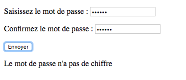

# Exercices formulaire

## 1. Vérificateur de mot de passe

- Doit faire plus de 6 caractères
- Doit contenir au moins 1 chiffre
- Les deux inputs doivent correspondre

```html
<form>
    <p>
        <label for="mdp1">Saisissez le mot de passe</label> :
        <input type="password" name="mdp1" id="mdp1" required>
    </p>
    <p>
        <label for="mdp2">Confirmez le mot de passe</label> :
        <input type="password" name="mdp2" id="mdp2" required>
    </p>

    <input type="submit" value="Envoyer">
</form>

<p id="infoMdp"></p>
```


## 2. Liste de personnage

- Un menu déroulant pour choisir une des maisons de Games of thrones
- Apparition d'une liste de nom faisant partie de cette maison

```html
<h1>Quelques personnages de Game of Thrones</h1>
    <form>
        <label for="maison">Maison</label> :
        <select name="maison" id="maison">
            <option value="" selected>Choisissez une maison</option>
        </select>
    </form>

    <p>
        <ul id="persos"></ul>
    </p>
<script>
    // Liste de quelques maisons de Game of Thrones. Chaque maison a un code et un nom
var maisons = [
    {
        code: "ST",
        nom: "Stark"
    },
    {
        code: "LA",
        nom: "Lannister"
    },
    {
        code: "BA",
        nom: "Baratheon"
    },
    {
        code: "TA",
        nom: "Targaryen"
    }
];

// Renvoie un tableau contenant quelques personnages d'une maison
function getPersonnages(codeMaison) {
    switch (codeMaison) {
    case "ST":
        return ["Eddard", "Catelyn", "Robb", "Sansa", "Arya", "Jon Snow"];
    case "LA":
        return ["Tywin", "Cersei", "Jaime", "Tyrion"];
    case "BA":
        return ["Robert", "Stannis", "Renly"];
    case "TA":
        return ["Aerys", "Daenerys", "Viserys"];
    default:
        return [];
    }
}
</script>
```

## 3. Autocomplétion

L'html 

```html
    <style>
        /* Augmente l'espacement gauche et droite des suggestions */
    .suggestion {
        padding-left: 2px;
        padding-right: 2px;
    }

    /* Modifie la couleur de la suggestion survolée par la souris */
    .suggestion:hover {
        background-color: #adf;
        cursor: pointer;
    }

    /* Positionne la liste des suggestions au-dessous de la zone de saisie */
    #suggestions {
        position: absolute;
        border: 1px solid black;
        left: 171px;
    }
    </style>

    <label for="pays">Tapez le nom d'un pays</label> :
    <input type="text" id="pays">
    <div id="suggestions"></div>

    <script>
        // Liste des pays
var listePays = [
    "Afghanistan",
    "Afrique du Sud",
    "Albanie",
    "Algérie",
    "Allemagne",
    "Andorre",
    "Angola",
    "Anguilla",
    "Antarctique",
    "Antigua-et-Barbuda",
    "Antilles néerlandaises",
    "Arabie saoudite",
    "Argentine",
    "Arménie",
    "Aruba",
    "Australie",
    "Autriche",
    "Azerbaïdjan"
];
    </script>
```

