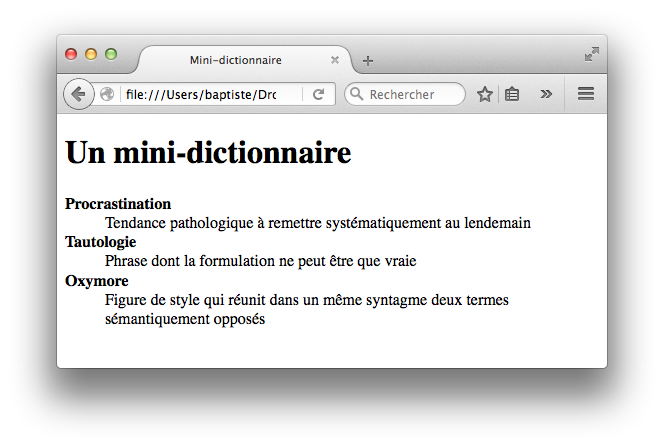

# Exercices sur le DOM

## 1) Gestion des attributs

```PHP

    <h1>Quelques instruments de musique</h1>
    <ul>
        <li id="clarinette" class="vent bois">
            La <a href="https://fr.wikipedia.org/wiki/Clarinette">clarinette</a>
        </li>
        <li id="saxophone" class="vent bois">
            Le <a href="https://fr.wikipedia.org/wiki/Saxophone">saxophone</a>
        </li>
        <li id="trompette" class="vent cuivre">
            La <a href="https://fr.wikipedia.org/wiki/Trompette">trompette</a>
        </li>
        <li id="violon" class="cordes frottees">
            Le <a href="https://fr.wikipedia.org/wiki/Violon">violon</a>
        </li>
    </ul>

```

1. Dis moi le nombre de lien qu'il y a dans la page.
2. Affiche moi le premier lien.
3. Refais le moi mais avec une fonction. Affiche aussi le dernier lien (même si tu rajoutes des liens il prendra toujours le dernier).

## 2) Afficher si un des éléments au dessus possède une classe choisie

Ajoutez à la fin du script le code suivant

```JS
possede("saxophone", "bois"); // Doit afficher true
possede("saxophone", "cuivre"); // Doit afficher false
possede("trompette", "cuivre"); // Doit afficher true
possede("contrebasse", "cordes"); // Doit afficher false

```

Faites une fonction possède qui prend 2 paramètres : l'id et la classe afin de vérifier si l'élément possède cette classe.

## 3) Créer un nouvel élément

Afficher chaque élément du tableau journaux dans une balise a Dans la div avec l'id "contenu".

html :

```HTML
<!doctype html>
<html>

<head>
    <meta charset="utf-8">
    <title>Quelques journaux en ligne</title>
</head>

<body>
    <h1>Quelques journaux en ligne</h1>
    <div id="contenu"></div>

    <script>

    // Liste des journaux
    var journaux = ["http://lemonde.fr", "http://lefigaro.fr", "http://liberation.fr"];

    // TODO : ajouter la liste des journaux sur la page, dans la div "contenu"
    
    </script>
</body>

</html>
```

Aide :

1. Faire une boucle sur le tableau
2. Créer un élément a
3. rajouter du texte pour chaque élément du tableau
4. transformer ce texte en href

5. Créer un enfant à #contenu
6. Créer un enfant br

## Dictionnaire

Créez un mini-dictionnaire. Vous devez utiliser le tableau `mot`. Employez la balise HTML<dl> pour créer ce dictionnaire. Chaque mot du dictionnaire doit être mis en valeur : utilisez pour cela la balise HTML<strong>.

Résulat :



```html

<!doctype html>
<html>

<head>
    <meta charset="utf-8">
    <title>Mini-dictionnaire</title>
</head>

<body>
    <h1>Un mini-dictionnaire</h1>
    <div id="contenu"></div>

    <script>
    // Liste des mots du dictionnaire
var mots = [
    {
        terme: "Procrastination",
        definition: "Tendance pathologique à remettre systématiquement au lendemain"
    },
    {
        terme: "Tautologie",
        definition: "Phrase dont la formulation ne peut être que vraie"
    },
    {
        terme: "Oxymore",
        definition: "Figure de style qui réunit dans un même syntagme deux termes sémantiquement opposés"
    }
];

// TODO : créer le dictionnaire sur la page web, dans la div "contenu"
    
    </script>
</body>

</html>

```