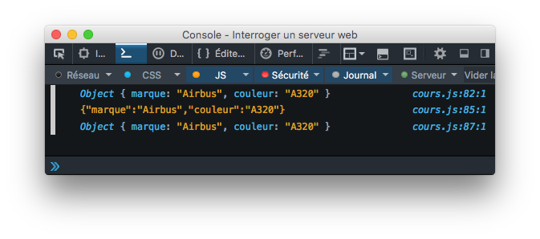
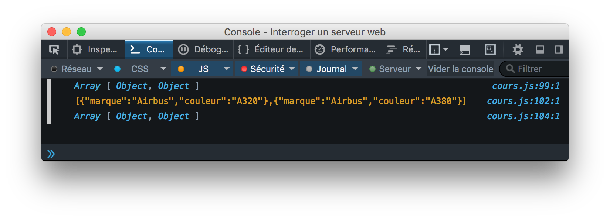

# Appel Ajax et Json

## Les fichiers :

- Le dossier data : les fichiers qui vont être interrogé en ajax.
    - films.json : un fichier json qui contient une liste de films.
    - langages.txt : un fichier texte.
    - tableaux.json : pour faire l'exercice.

- le dossier js
    - ajax.js : contient la fonction ajaxGet, c'est la connexion au serveur
    - cours.js : l'appel de la fonction ajaxGet. Du coup c'est là qu'il y a le chemin vers nos fichiers qui se trouvent dans le dossier data.

## L'html

```html
    <script src="./js/ajax.js"></script> <!-- connexion au serveur -->
    <script src="./js/cours.js"></script> <!-- chemin des requetes -->
```

<p style="color:red;">Le fichier ajax.js doit toujours être inclus dans la page web AVANT les autres fichiers JavaScript qui utilisent les fonctions qu'il contient.</p>

## ajax.js

```JS
// Exécute un appel AJAX GET
// Prend en paramètres l'URL cible et la fonction callback appelée en cas de succès
function ajaxGet(url, callback) {

    // L'objet JavaScript XMLHttpRequest permet de créer une requête HTTP
    var req = new XMLHttpRequest();

    req.open("GET", url);
    
    req.addEventListener("load", function () {
        if (req.status >= 200 && req.status < 400) {
            // Appelle la fonction callback en lui passant la réponse de la requête
            callback(req.responseText);
        } else {
            console.error(req.status + " " + req.statusText + " " + url);
        }
    });
    req.addEventListener("error", function () {
        console.error("Erreur réseau avec l'URL " + url);
    });
    req.send(null);
}
```

`XMLHttpRequest`: est un objet javascript qui permet de récupérer des données via HTTP. Pour l’utiliser il suffit de créer une instance de cet objet, d’ouvrir une URL et d’envoyer la requête
`const req = new XMLHttpRequest();`

### Types d'erreurs

On distingue deux principaux cas d'erreur :

- La requête n'a pas réussi à atteindre le serveur (nom du serveur incorrect, erreur réseau, etc). Ces erreurs déclenchent l'apparition d'un événement de type `error` sur la requête. Le gestionnaire associé affiche le message "Erreur réseau" dans la console.

- La requête a atteint le serveur, mais son traitement a échoué (ressource demandée non trouvée, problème interne au serveur, etc). C'est le code de retour HTTP de la requête, contenu dans sa propriété `status`, qui indique son résultat. Un code supérieur ou égal à 200 et strictement inférieur à 400 signale la réussite de la requête.

L'objet JavaScript `XMLHttpRequest` permet de créer une requête HTTP. Sa méthode `open` configure la requête. Sa méthode `send` l'envoie vers l'URL cible.

## cours.js

```JS
// Lien vers le fichier texte
ajaxGet("http://localhost/github/javascriptCoursExercices/ajaxJson/data/langages.txt", function (reponse) {
    console.log(reponse);
});

// le fichier film
ajaxGet("http://localhost/github/javascriptCoursExercices/ajaxJson/data/films.json", function (reponse) {
    // Transforme la réponse en tableau d'objets JavaScript
    var films = JSON.parse(reponse);
    // Affiche le titre de chaque film
    films.forEach(function (film) {
        console.log(film.titre);
    })
});

```

## Explication Gestion du format JSON par JavaScript

La fonction `JSON.parse` permet de transformer une chaîne de caractères conforme au format JSON en un objet JavaScript. 
La fonction `JSON.stringify` joue le rôle inverse : elle transforme un objet JavaScript en chaîne de caractères conforme au format JSON.

```JS
var avion = {
    marque: "Airbus",
    couleur: "A320"
};
console.log(avion);
// Transforme l'objet JavaScript en chaîne de caractères JSON
var texteAvion = JSON.stringify(avion);
console.log(texteAvion);
// Transforme la chaîne de caractères JSON en objet JavaScript
console.log(JSON.parse(texteAvion));

```


### Ces fonctions permettent aussi de gérer les tableaux d'objets JSON.

```JS
var avions = [
    {
        marque: "Airbus",
        couleur: "A320"
    },
    {
        marque: "Airbus",
        couleur: "A380"
    }
];
console.log(avions);
// Transforme le tableau d'objets JS en chaîne de caractères JSON
var texteAvions = JSON.stringify(avions);
console.log(texteAvions);
// Transforme la chaîne de caractères JSON en tableaux d'objets JavaScript
console.log(JSON.parse(texteAvions));
```




