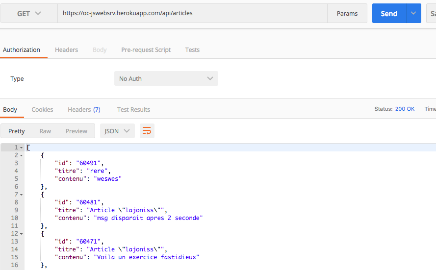
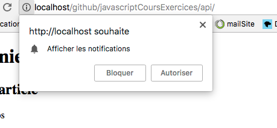

# Utilisez des API web

## 1. Introduction

Une api est un ensemble de services offert par un logiciel à d'autres logiciels. Grâce aux API, les programmes informatiques peuvent interagir entre eux selon des conditions déterminées.

Pour pouvoir consommer (utiliser) une API web, il faut connaître son adresse et son mode de fonctionnement. La plupart des API web sont accessibles via une URL et utilisent <span style="color:green">le format JSON</span> pour les échanges de données.

- API REST d’Instagram, de Gmail, GitHub (voir exercice), et Weather Underground etc..
- API de vibration (voir point 3)
- API google map (Voir point 5)
- Google Maps Geolocation API (voir point 6)
- API Facebook : Ajouter Facebook Login à votre application ou votre site web
- API Twilio : qui fournit un modèle permettant de créer des fonctionnalités d'appel vocal et vidéo dans votre application, d'envoyer des SMS/MMS depuis vos applications, et plus encore. [lien](https://www.twilio.com/)

## 2. Testez une API web avec le navigateur

La première API que nous allons utiliser expose une liste d'articles, un peu à la manière d'un blog. Elle est accessible à l'URL https://oc-jswebsrv.herokuapp.com/api/articles et renvoie des données au format JSON.

<p style="color:red;">Pour une meilleure présentation du réslutat installer l'extension Postman pour chrome et RESTClient pour firefox</p>

Ouvrez l'application postman, on peut l'utiliser pour envoyer une requête HTTP GET vers l'URL de API et analyser en détail le résultat.



## Exploitez une API web avec javascript

- le fichier html
- le dossier js :
    - ajax.js (requête http, gestion des erreurs).
    - cours.js (requête).

Html :
```html
<!doctype html>

    <h1>Derniers articles</h1>
    <div id="articles">
    </div>

    <h1>Le Premier Ministre</h1>
    <div id="premMin">
    </div>

    <h1>La météo à Lyon</h1>
    <div id="meteo"></div>

    <script src="./js/ajax.js"></script>
    <script src="./js/cours.js"></script>

```
ajax.js
```js
// Exécute un appel AJAX GET
// Prend en paramètres l'URL cible et la fonction callback appelée en cas de succès
function ajaxGet(url, callback) {

    // L'objet JavaScript XMLHttpRequest permet de créer une requête HTTP
    var req = new XMLHttpRequest();

    req.open("GET", url);
    
    req.addEventListener("load", function () {
        if (req.status >= 200 && req.status < 400) {
            // Appelle la fonction callback en lui passant la réponse de la requête
            callback(req.responseText);
        } else {
            console.error(req.status + " " + req.statusText + " " + url);
        }
    });
    req.addEventListener("error", function () {
        console.error("Erreur réseau avec l'URL " + url);
    });
    req.send(null);
}
```

cours.js

```js
var articlesElt = document.getElementById("articles");
ajaxGet("https://oc-jswebsrv.herokuapp.com/api/articles", function (reponse) {
    // Transforme la réponse en un tableau d'articles
    var articles = JSON.parse(reponse);
    articles.forEach(function (article) {
        // Ajout du titre et du contenu de chaque article
        var titreElt = document.createElement("h2");
        titreElt.textContent = article.titre;
        var contenuElt = document.createElement("p");
        contenuElt.textContent = article.contenu;
        articlesElt.appendChild(titreElt);
        articlesElt.appendChild(contenuElt);
    });
});
```


## 3. api de vibration

Faire vibrer son gsm au click sur le bouton
html : ` <button onclick="vibration()">Vibrer</button>` 

```JS
function vibration(){
    navigator.vibrate([500, 250, 500, 250, 500, 250, 500, 250, 500, 250, 500]); // Vibre 5ms pause 2.5ms
}
vibration();
```

Arrêter la vibration :

```js
function stopVibrations() {
  navigator.vibrate(0);
}
```

## 4. API de notification

méthode : `Notification.requestPermission()`. Ca demandera la permission d'autoriser les notifications à l'utilisateur avec une boite de dialogue. 
Peut servir par exemple à avertir l'utilisateur quand quelqu'un à rajouté une tâche dans une to-do-list

```js
Notification.requestPermission().then(function(result) {
  console.log(result);
});
```



[tuto notifications developer mozilla](https://developer.mozilla.org/en-US/docs/Web/API/Notifications_API/Using_the_Notifications_API)


## 5. API Google Maps

source : [developers.google](https://developers.google.com/maps/)

```html
<body>
    <h3>My Google Maps Demo</h3>

    <div id="map"></div> <!-- La zone ou ira la map-->

    <script>
      function initMap() {

        // lolisation d'une rue
        var uluru = {lat: 50.8607254, lng: 4.383531500000004};

        // On ajoute l'objet google Map dans la div
        var map = new google.maps.Map(document.getElementById('map'), {
          zoom: 15, // spécifie le niveau de zoom de la carte. 0 = La terre entière
          center: uluru // On centre par rapport à la rue
        });

        // On ajoute l'objet marqueur
        var marker = new google.maps.Marker({
          position: uluru,
          map: map
        });
      }
    </script>
    <script async defer 
    src="https://maps.googleapis.com/maps/api/js?key=YOUR_API_KEY&callback=initMap">
    </script>
```

`async defer` : autorise le navigateur à continuer à rendre le reste de votre page pendant le chargement de l'API.
`&callback=initMap` : Le paramètre callback exécute la fonction initMap une fois que l'API est complètement chargée.

Trouver la latitude et longitude d'une rue : [coordonnée gps](https://www.coordonnees-gps.fr/)

## 6. Google Maps Geolocation API

Google Maps Geolocation API renvoie un point géographique et un rayon précis à partir des données des antennes-relais et des nœuds Wi-Fi détectés par le client mobile.

La communication est assurée via la méthode POST du protocole HTTPS. La requête et la réponse sont toutes les deux configurées au format JSON et leur contenu est de type application/json.

### Requêtes de géolocalisation ( A venir)

[choisir ce qu'on veut faire](https://developers.google.com/maps/documentation/api-picker)

<p style="color:red;">Attention, depuis 2016-2017 la plupart des navigateurs (dont Chrome, Opera) demandent d'utiliser le protocole https:// pour pouvoir accéder à la géolocalisation. Si vous faites vos tests en local et/ou en http:// classique, la fonction sera désactivée.</p>

```html
<script>
    if("geolocation" in navigator) {
        navigator.geolocation.getCurrentPosition(function(position) {
        var latlng = new google.maps.LatLng(position.coords.latitude,position.coords.longitude);
        var myOptions = {
            zoom: 15,
            center: latlng,
            mapTypeId: google.maps.MapTypeId.TERRAIN,
            disableDefaultUI: true
        }
        var map = new google.maps.Map(document.getElementById("map2"), myOptions);
        });
        } else {
        var para = document.createElement('p');
        para.textContent = 'Argh, no geolocation!';
        document.body.appendChild(para);
    }
</script>
```

### Corps de la requête

## 7. API Facebook (login)

Ajouter Facebook Login à votre application ou votre site web [lien](https://developers.facebook.com/docs/facebook-login/overview)

1. Créer une app dans votre developers.facebook.com (je l'ai appele SeConnecterAvecF).

2. Ajouter le produit Facebook.
    1. Choisissez votre plateforme (moi c'est pour le web)
    2. l'url de votre site (moi http://localhost/github/javascriptCoursExercices/api/)
    3. Copier le code que l'on vous donne juste après l'ouverture de `<body>`. Remplacez {your-app-id} par l’ID d’app et {latest-api-version} par la version du SDK. (Enlever les brackets mais garder les guillements) . L'Id est dans le haut de votre page facebook pour developers. La version est 1.0 (on vient de commencer).
    4. Vérifier si l'utilisateur est déjà connectée à votre app avec facebook Login

```js
    // FB.getLoginStatus : méthode qui déclanche un appel vers facebook pour obtenir l'état de connexion
    FB.getLoginStatus(function(response) {
        // Puis appelle les fonctions de rappel avec le resultat
        statusChangeCallback(response);
    });
```


Dans les exercices :

- Se connecter à l'api de github